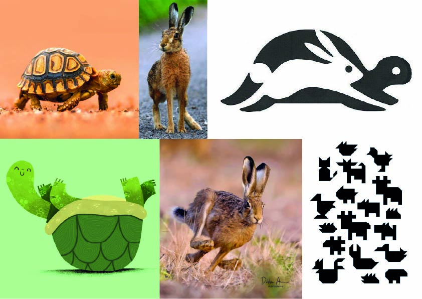

# Dois em Um

<!--
  HERO: idealmente uma pseudo-sessão fotográfica do produto
  (ver tutorial Pletor.ai nos Recursos da disciplina, em
  /Recursos/AI_exps/). Usa attachments/hero.jpg para o frontmatter.
-->

> Brinquedo modular em madeira inspirado no conto da lebre e da tartaruga.

A página deve tornar **visualmente percetível** a estratégia de resposta ao enunciado.
Segue a estrutura de **prancha-resumo** + **esquema-base** (C-E-T-F).

## Conceito

Trata-se de um brinquedo em madeira, inspirado na fábula "A lebre e a tartaruga", concebido através de um sistema de peças de encaixe que permite múltiplas configurações formais. O conjunto possibilita a construção das figuras da lebre e da tartaruga, bem como de variações intermédias e composições híbridas, explorando a noção de permutabilidade morfológica e reconfiguração estrutural. O objeto assenta numa lógica de construção desmontável, onde a forma final emerge da articulação entre elementos geométricos simples e sistemas de ligação precisos.

**Para quem?**  
Destina-se essencialmente ao público infantil em contexto educativo, podendo igualmente ser utilizado por utilizadores interessados em práticas de construção lúdica, design generativo e jogos de lógica espacial. O objeto integra-se em ambientes pedagógicos formais e informais, promovendo experiências de aprendizagem ativa, experimentação material e exploração tridimensional.

**Porquê?**  
O projeto propõe uma abordagem pedagógica baseada na experimentação e na construção, incentivando o desenvolvimento da coordenação motora, da percepção espacial e do pensamento construtivo. Ao reinterpretar uma narrativa clássica, promove-se a compreensão de processos de transformação e diversidade formal, sublinhando que diferentes combinações de elementos podem gerar soluções múltiplas e abertas. Paralelamente, o brinquedo valoriza uma dimensão ecológica e material, ao privilegiar a madeira como recurso sustentável e ao reforçar a ideia de reutilização e continuidade do ciclo dos materiais, integrando assim uma lógica de design consciente e culturalmente significativo.

## Enquadramento

O brinquedo insere-se no contexto do grupo através da simplificação e síntese formal das personagens da narrativa _A Lebre e a Tartaruga_. O desenvolvimento do projeto parte da análise interpretativa das duas figuras centrais do conto, entendidas não apenas como representações figurativas, mas como pontos de partida para um processo de abstração morfológica.
## Tecnologia

Materiais (espécie de madeira), processos de fabrico (CNC, laser, impressão 3D), software paramétrico, ficheiros técnicos.

- Modelo 3D: <!-- embed Fusion ou link a360.co -->https://a360.co/4wZUHnW
- Ficheiros: `attachments/`

## Função

O brinquedo destina-se a crianças dos 6 aos 9 anos e consiste num sistema modular em madeira com encaixes minimalistas, inspirado na fábula "A lebre e a tartaruga".

**Como brincar:** 
A criança utiliza as peças para construir as figuras da lebre e da tartaruga, podendo também explorar combinações alternativas entre ambas, criando variações formais livres. A atividade baseia-se na montagem e desmontagem contínua, promovendo a exploração, o pensamento construtivo e o desenvolvimento da motricidade e da percepção espacial.

**Termos de segurança:**
O projeto segue os princípios da Diretiva Europeia de Segurança dos Brinquedos (2009/48/CE), utilizando materiais não tóxicos e madeira tratada, com peças dimensionadas para evitar riscos de ingestão. Os encaixes são concebidos para garantir estabilidade e reduzir perigos mecânicos, como arestas cortantes ou fragilidade estrutural. O produto pressupõe ainda ensaios de conformidade, incluindo testes mecânicos e verificação de materiais, bem como a marcação CE e instruções adequadas à idade alvo.
## Apresentação

Imagens chave que sintetizam o produto final.

---

## Processo

O percurso completo de iterações, modelos e pesquisa está em [processo.md](processo.md), organizado do **mais recente** para o **mais antigo**.

[Ver processo completo →](processo.md)
