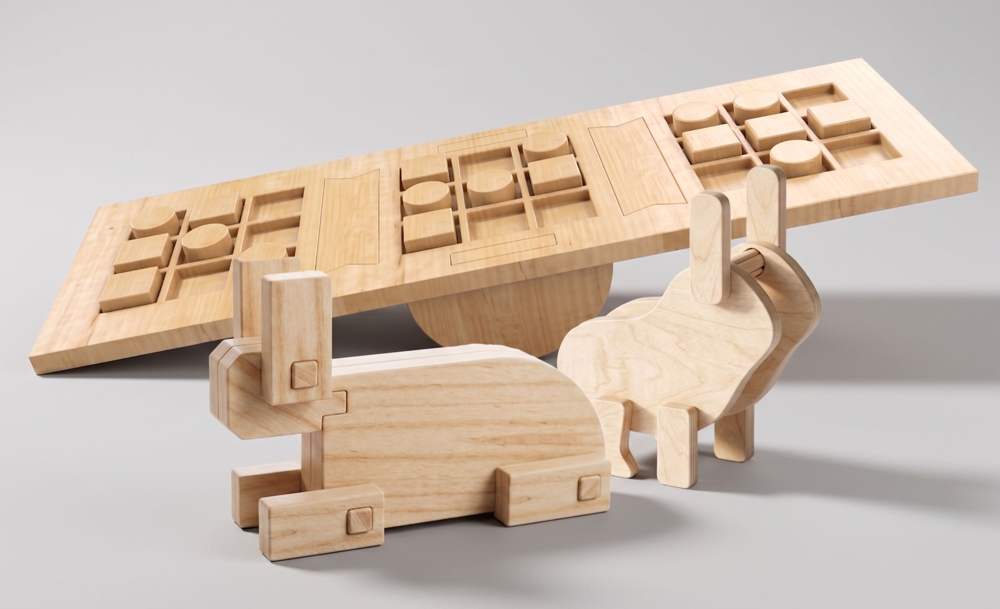
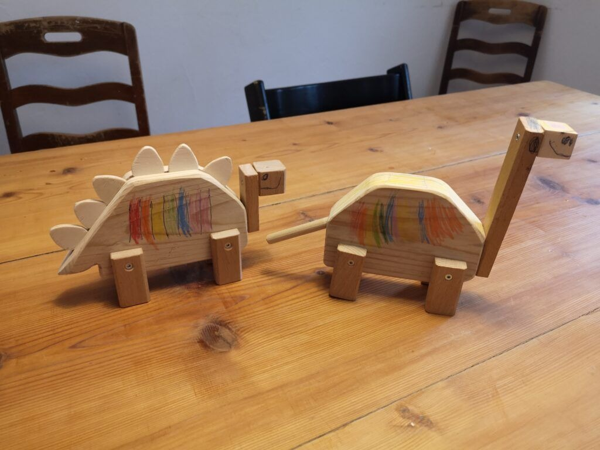
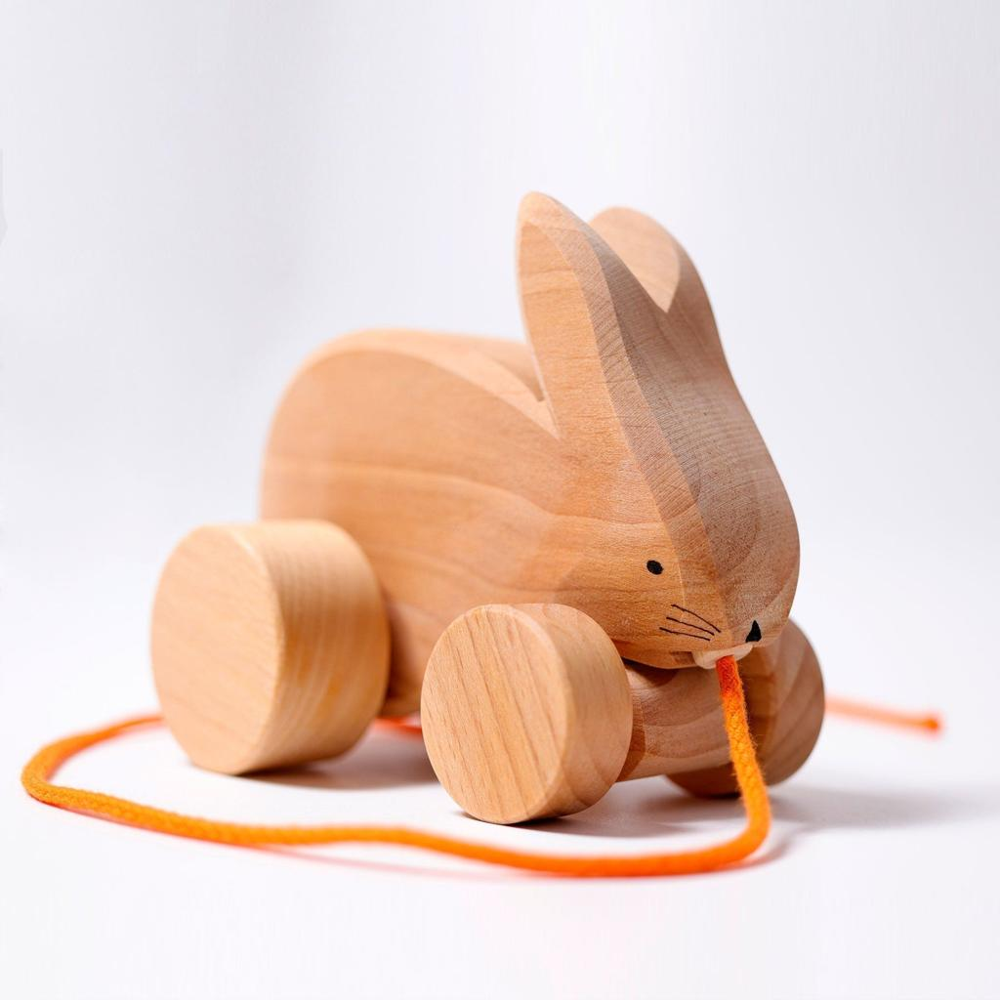
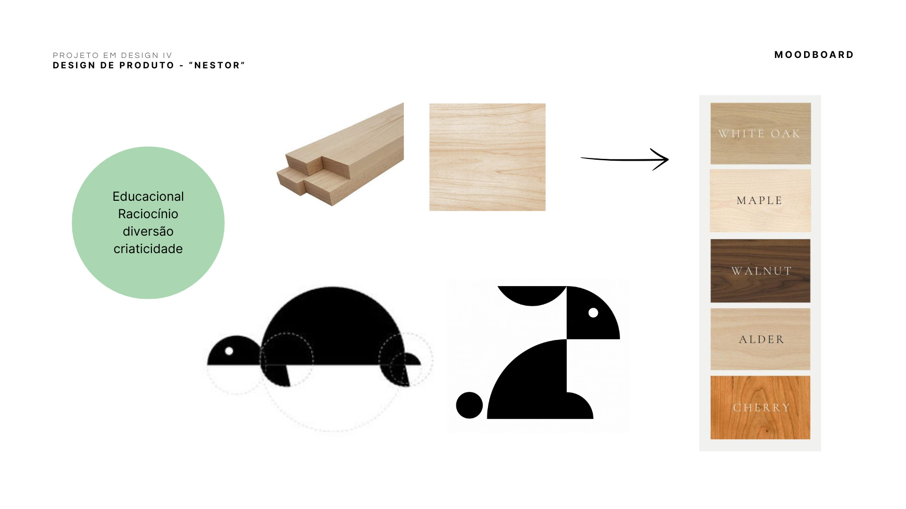

# Contexto de Design

## 1. Resumo / Abstract

### Resumo (PT)

O fio condutor que relaciona os produtos expostos neste projeto é a clássica fábula da **Lebre e da Tartaruga**. Mais do que uma inspiração para as formas e as personagens, esta história serve como metáfora central para o nosso conceito. Acreditamos que o desenvolvimento de uma criança não é uma corrida de velocidade, mas sim uma jornada contínua de descoberta, onde o equilíbrio, a paciência e a persistência são fundamentais. Cada criança tem o seu próprio ritmo, seja ele rápido como a lebre ou ponderado como a tartaruga, e os nossos brinquedos são desenhados para respeitar isso mesmo.

Os nossos produtos partilham funções e objetivos educacionais comuns, onde através de interações táteis e mecânicas simples, os brinquedos estimulam o desenvolvimento da noção de equilíbrio, a coordenação espacial e o raciocínio lógico. A brincadeira transforma-se num momento de aprendizagem ativa, onde a diversão é o veículo principal para o crescimento.

Para materializar este conceito, o projeto utiliza a madeira como material base para garantir uma produção sustentável, dando assim uma nova vida aos resíduos industriais. Esta escolha acaba por ser uma decisão ética e funcional, ao transformar o desperdício em ferramentas de aprendizagem, garantimos que a interação com texturas naturais reforce a ligação da criança ao ambiente, assegurando em simultâneo a durabilidade, o reaproveitamento de recursos e a segurança das peças.

### Abstract (EN)

The common thread connecting the products showcased in this project is the classic fable of **The Tortoise and the Hare**. More than just an inspiration for the shapes and characters, this story serves as the central metaphor for our concept. We believe that a child's development is not a sprint, but rather a continuous journey of discovery, where balance, patience, and persistence are fundamental. Each child has their own pace, whether fast like the hare or steady like the tortoise, and our toys are designed to respect exactly that.

Our products share common educational functions and objectives. Through simple tactile and mechanical interactions, the toys stimulate the development of a sense of balance, spatial coordination, and logical reasoning. Playtime transforms into a moment of active learning, where fun becomes the main vehicle for growth.

To bring this concept to life, the project uses wood as its base material to ensure sustainable production, thus giving new life to industrial waste. This choice proves to be both an ethical and a functional decision. By transforming waste into learning tools, we ensure that interacting with natural textures reinforces the child's connection to the environment, while simultaneously guaranteeing the durability, resource repurposing, and safety of the pieces.

## 2. Referências Coletivas

### 2.1. Recolha de Objetos a Redesenhar/Remisturar

- **Objeto 1** — Holzdinosaurier Bausatz

O Holzdinosaurier Bausatz é um brinquedo de construção em madeira composto por várias peças de encaixe que, quando montadas, formam a figura tridimensional de um dinossauro. O objeto foi selecionado como referência devido à sua abordagem construtiva, baseada na montagem de componentes independentes através de sistemas simples de encaixe.

A principal característica valorizada foi a forma como diferentes peças planas se articulam para criar um volume tridimensional reconhecível, promovendo simultaneamente a exploração espacial, a coordenação motora e a compreensão das relações entre as partes e o todo. O sistema construtivo do brinquedo serviu de inspiração para o desenvolvimento de soluções de encaixe aplicadas ao projeto, demonstrando como elementos simples podem gerar uma experiência lúdica e educativa através da montagem e da interação física.

- **Objeto 2** — Montessori

Para o desenvolvimento deste projeto, foi escolhido como referência o Montessori Wooden Rabbit Puzzle, um brinquedo educativo em madeira inspirado na pedagogia Montessori, desenvolvida no início do século XX por Maria Montessori. Este tipo de brinquedo surgiu no contexto do método Montessori, criado com o objetivo de promover a aprendizagem autónoma da criança através da exploração sensorial e da interação direta com objetos físicos.
Os brinquedos Montessori distinguem-se pela utilização de materiais naturais, especialmente a madeira, e pela sua linguagem formal simples, sem elementos visuais excessivos ou decorativos. O Wooden Rabbit Puzzle insere-se nesta tipologia, apresentando uma representação simplificada de um animal através de formas geométricas básicas que permitem à criança reconhecer a figura e, simultaneamente, desenvolver competências motoras, cognitivas e espaciais.
A origem deste brinquedo está, assim, associada à necessidade de criar objetos pedagógicos que incentivem a coordenação motora fina, a perceção tátil e a capacidade de resolução de problemas, valorizando a aprendizagem através da experiência prática.

A escolha do **Montessori Wooden Rabbit Puzzle** como referência para o redesenho do meu brinquedo deve-se principalmente à sua abordagem minimalista e à forma como simplifica a anatomia de um animal em volumes essenciais. Esta característica relaciona-se diretamente com o conceito do meu projeto, uma vez que também procuro representar uma lebre através de uma linguagem formal simples, geométrica e facilmente reconhecível.
Além disso, este brinquedo foi escolhido por demonstrar um equilíbrio entre função lúdica, valor educativo e qualidade estética. Esta combinação tornou-se particularmente relevante para o desenvolvimento do meu projeto, pois permitiu analisar de que forma um brinquedo pode ir além da sua função recreativa e assumir também um papel pedagógico e de design.

### 2.2. Moodboard

