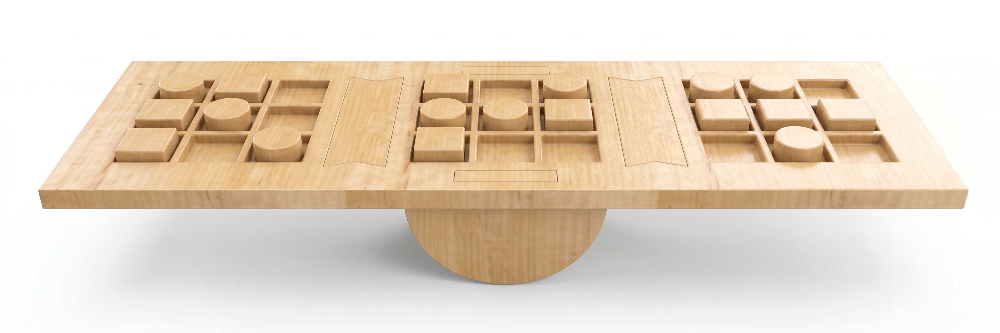
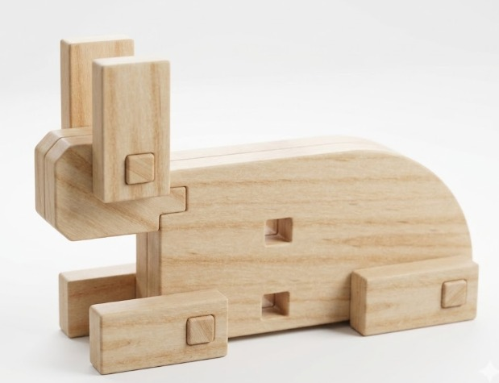
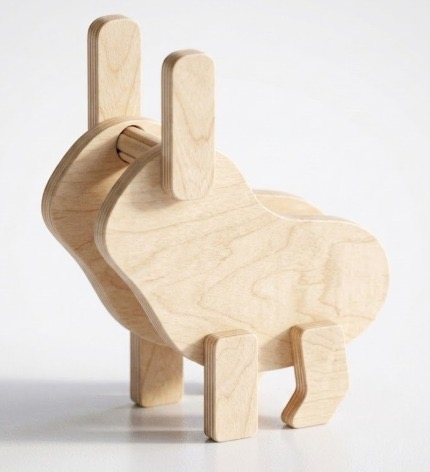

# Peça a Peça

> Os nossos brinquedos inspiram-se no conto da lebre e da tartaruga, procurando transmitir a ideia de que “devagar se vai longe”. Tal como indica o nosso slogan, passo a passo, acreditamos que, através dos nossos brinquedos, o público infantil pode desenvolver capacidades lógicas e de resolução de problemas de forma progressiva e consistente.

## Elementos do Grupo

| Número  | Nome             |
| ------- | ---------------- |
| 2024262 | Daniel Gonçalves |
| 2024281 | Gabriela Graça   |
| 2024328 | Matilde Ferreira |

---

## Contexto de Design

> Usando a fábula da Lebre e da Tartaruga como conceito principal, o grupo Peça a Peça desenvolveu uma linha de brinquedos em madeira que têm como objetivo unir o desenvolvimento educacional à diversão, promovendo a criatividade, imaginação e aprendizagem continua através da exploração e da brincadeira livre. 
> O design visual e a interatividade dos produtos da nossa marca focam-se numa fábula clássica, cativando a imaginação e a curiosidade do público infantil.
> Estes brinquedos foram criados em madeira como material base para garantir uma produção sustentável.

Resumo, referências coletivas e moodboard do grupo encontram-se em [contexto.md](contexto.md).

[Ver contexto completo →](contexto.md)

---

## Galeria de Produtos

<!-- Cada thumbnail liga à página individual de cada produto.
     Cada produto vive em produtos/<numero>-<nome>/index.md
     e tem uma sub-página produtos/<numero>-<nome>/processo.md -->

<!-- markdownlint-disable MD033 -->

  <!-- duplicar o bloco abaixo para cada produto do grupo -->

  <a class="gallery-card" href="produtos/Gabriela/">
    
    <h3>Corrida do Equilíbrio</h3>
    
Gabriela Graça

  </a>
<a class="gallery-card" href="produtos/Daniel/">
    
    <h3>Dois em Um</h3>
    
Daniel Gonçalves

  </a>
  <a class="gallery-card" href="produtos/Matilde/">
    
    <h3>A Lebre</h3>
    
Matilde Ferreira

  </a>
  <!-- duplicar o bloco acima para cada produto do grupo  e substituir _modelo em ambas por <numero>-<nome> -->

<!-- markdownlint-enable MD033 -->
