# Processo

## 1. Protótipo(s)

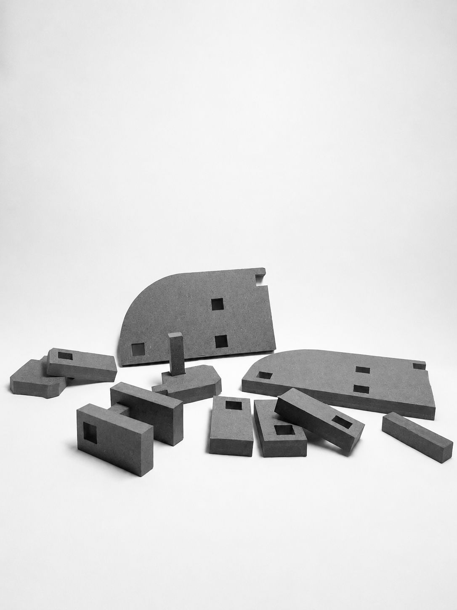
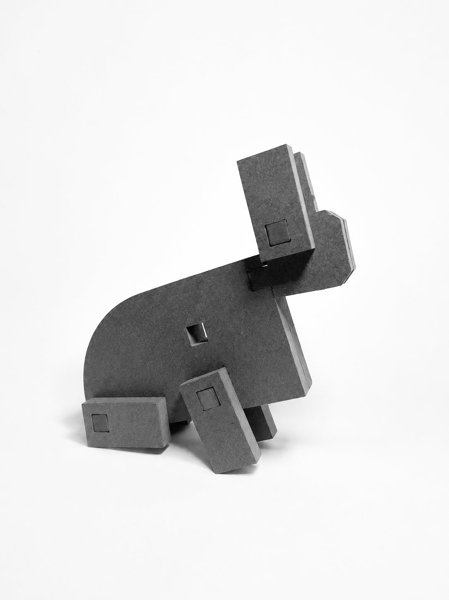

## 2. Processo de Prototipagem

Maquinação CNC, montagem, acabamentos pontuais. 

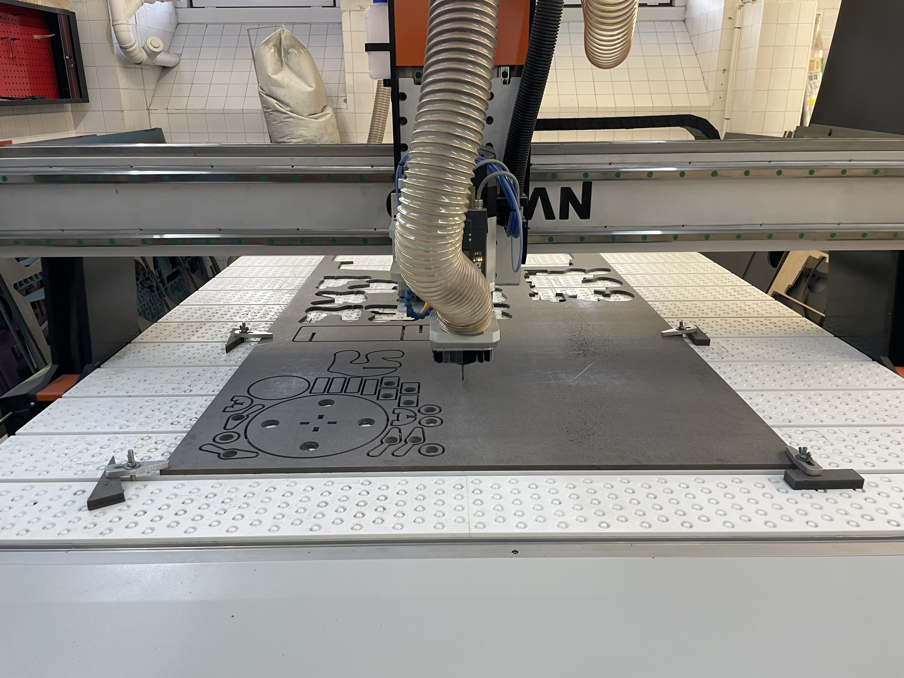
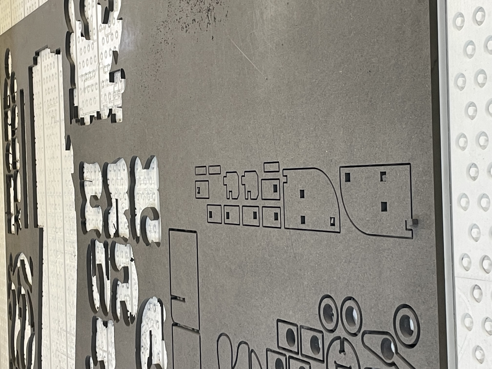
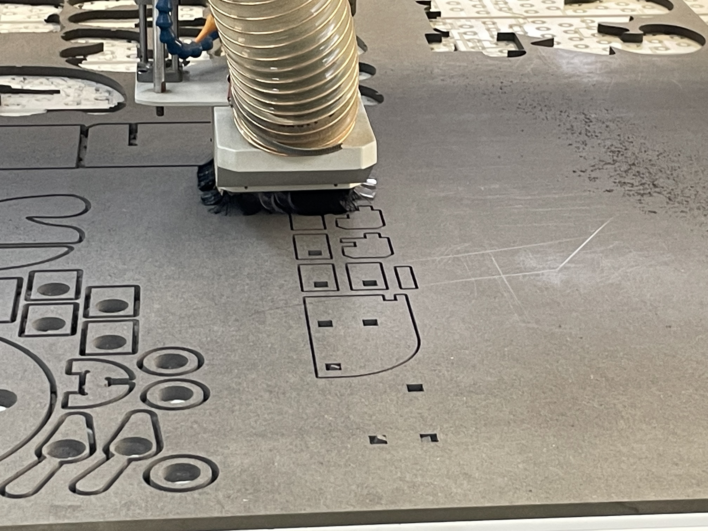
## 3. Protótipos Exploratórios

Testes CNC prévios, ensaios em escala, experiências de juntas/encaixes.

## 4. Modelos 3D

Embed do Fusion (visualização do modelo paramétrico).

https://a360.co/4nqYoPa

## 5. Outros Modelos

Modelos físicos exploratórios, em cartão, espuma, madeira de teste.

## 6. Esboços e Pranchas-Resumo

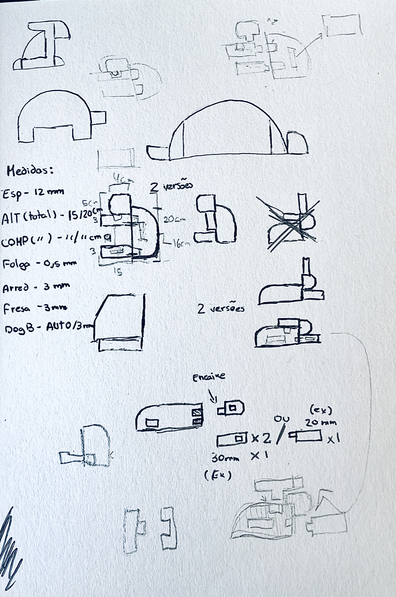
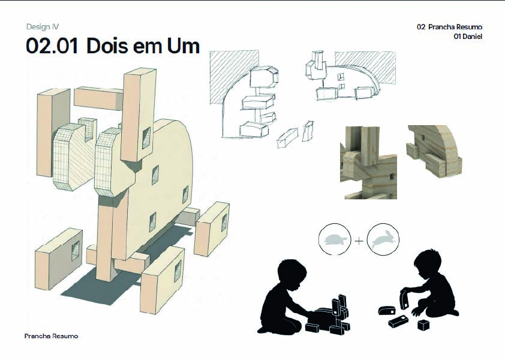
## 7. Pesquisa

### 7.1. Aspectos valorizados do moodboard, desconstrução da forma (o que distingue o programa formal)

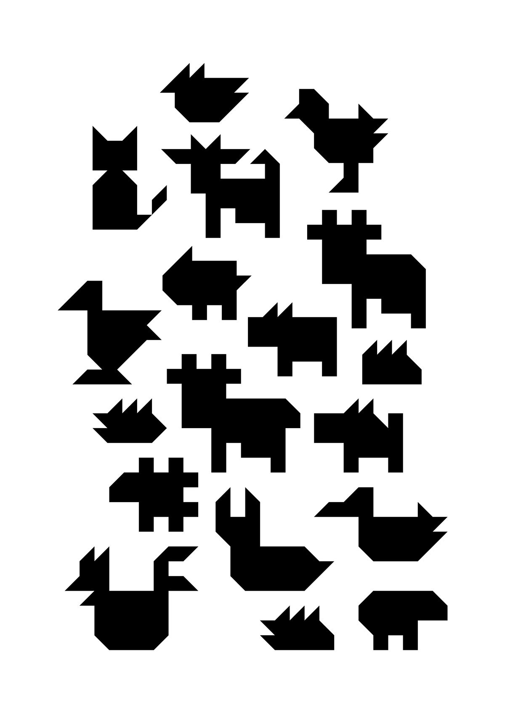

### 7.2. Objetos de referencia

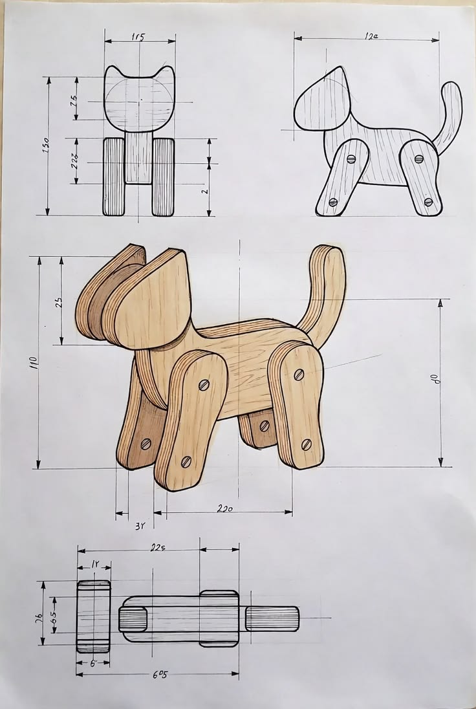
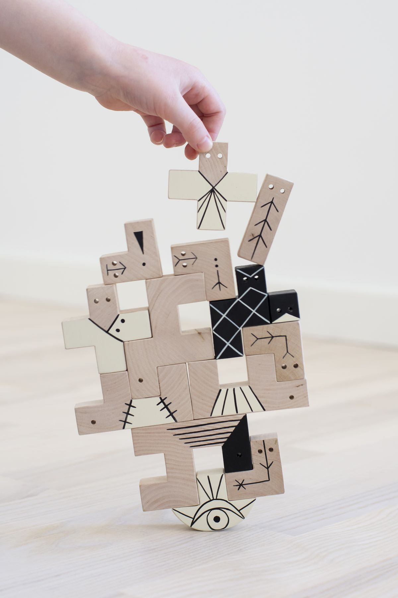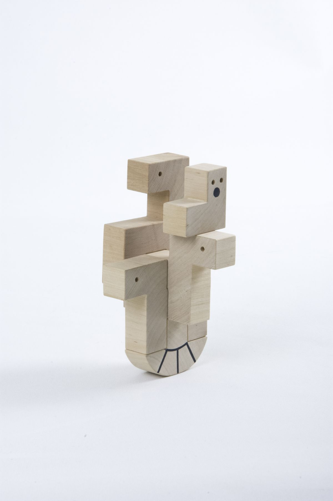
## 9. Outros Elementos

"16 Animali" de Enzo Mari
(https://www.danesemilano.com/en/productDetails?idProduct=60)

"A Fabula que deu origem ao projeto"
https://www.youtube.com/watch?v=2DrKmpuKhKE
