# Processo

## 1. Protótipo(s)

Protótipo de espessura de 12 mm, representando a versão do produto desmontado.

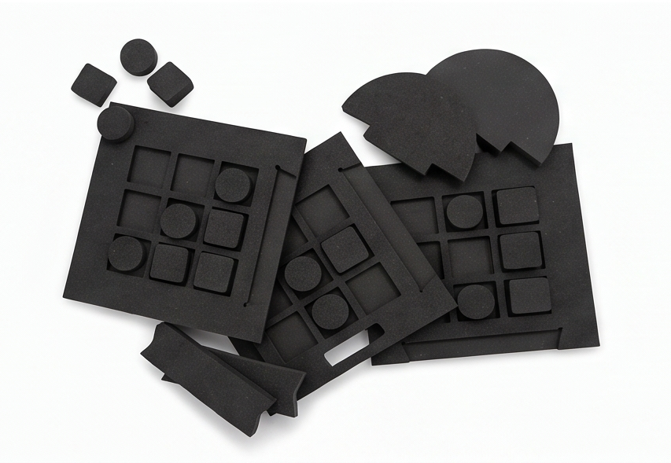
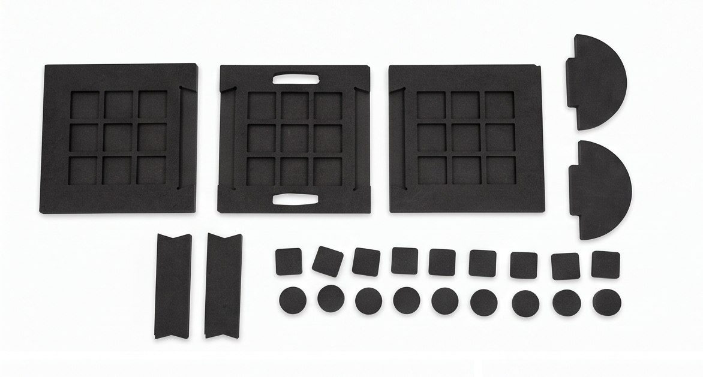
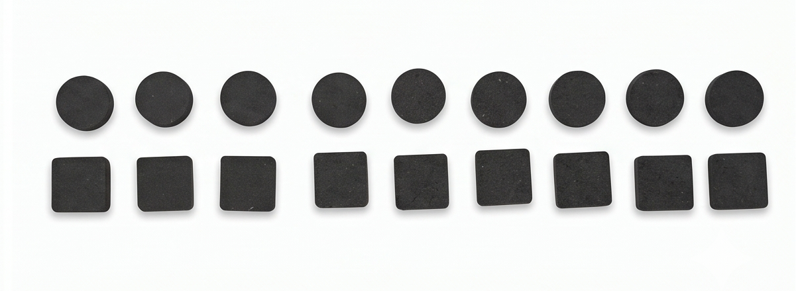
## 2. Processo de Prototipagem

O seu processo desenvolveu-se a partir de modelação no Fusion 360, onde depois da preparação dos ficheiros, foi para corte em CNC, para por fim ser feita a montagem e acabamentos finais.

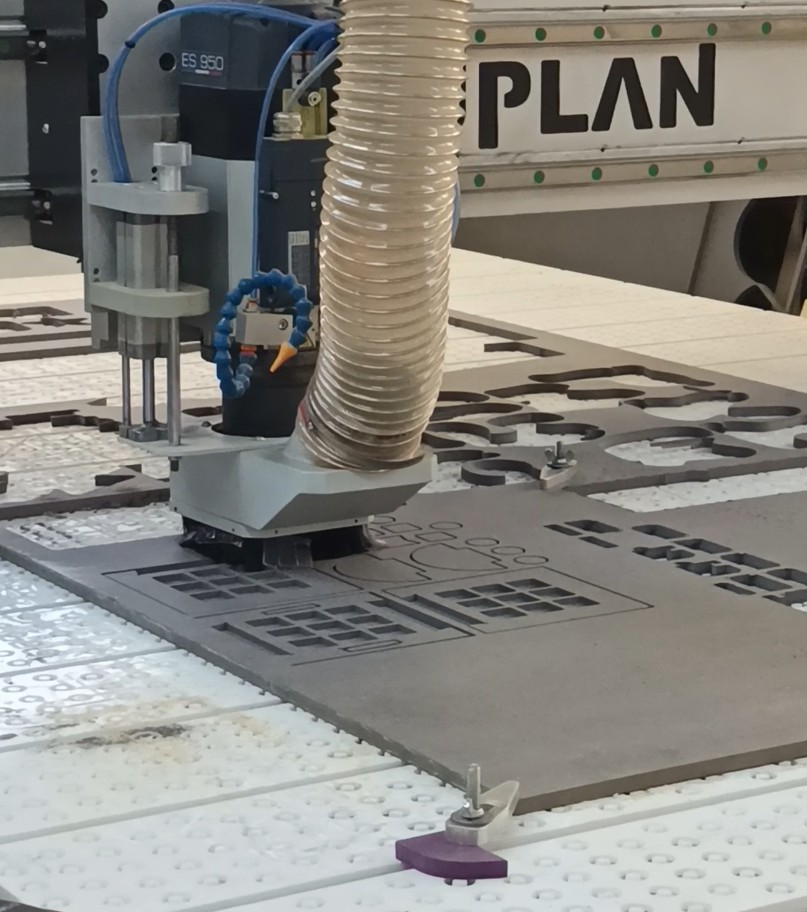
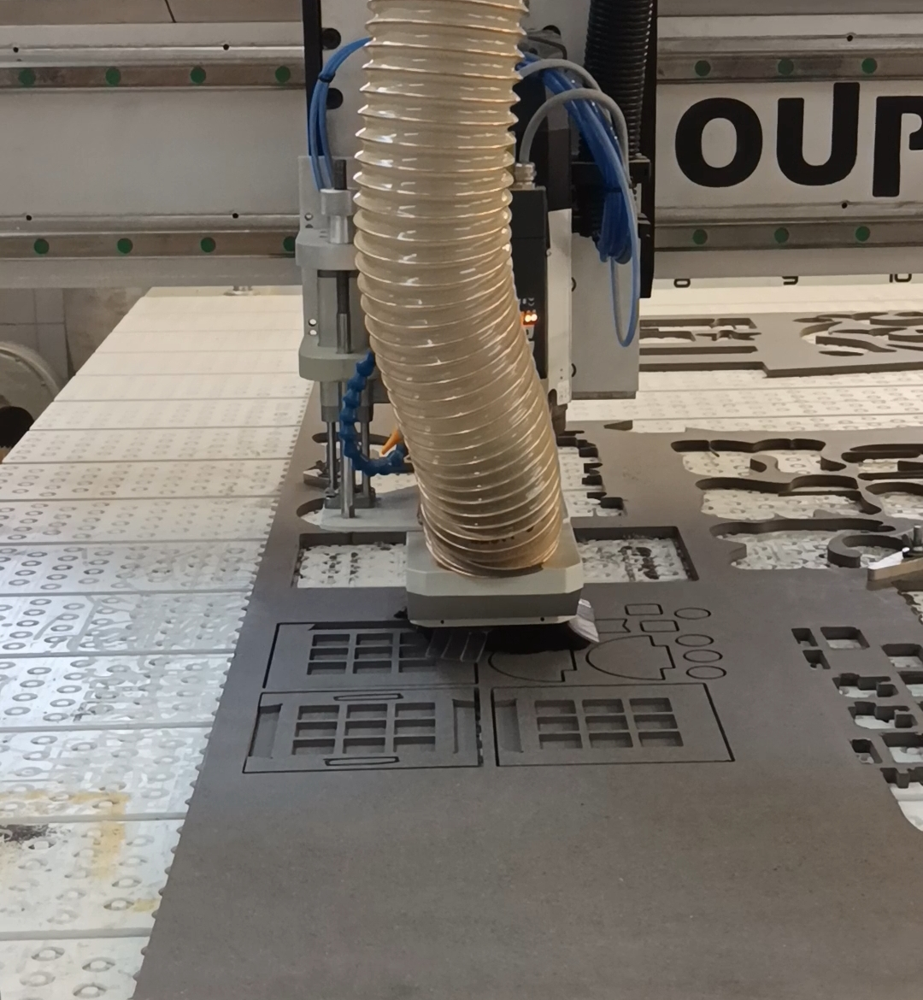
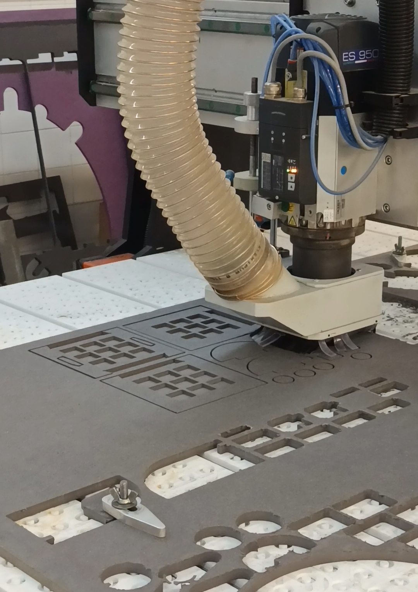

## 3. Modelos 3D

https://a360.co/3PQSive

## 4. Esboços e Pranchas-Resumo

Desenvolvimento de geometrias, encaixes e organização visual mediante esboços e pranchas-resumo.

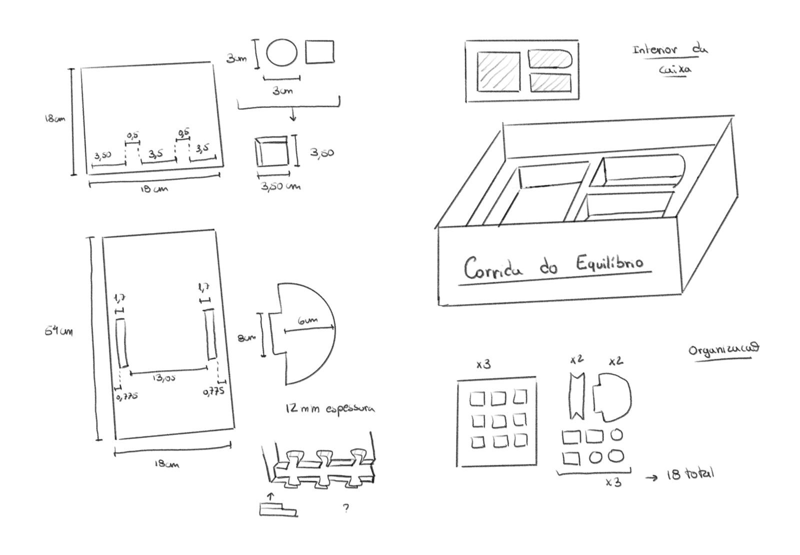

*** Pranchas resumo - experimentos iniciais

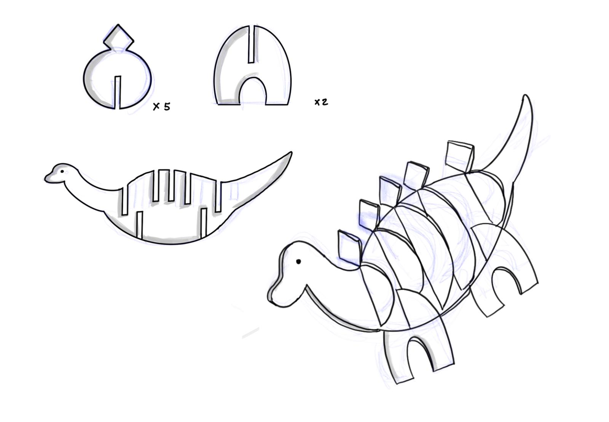
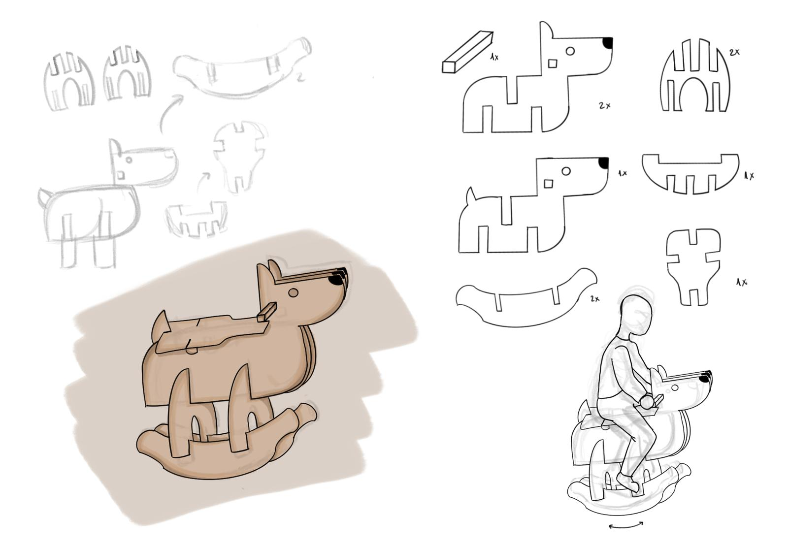

O projeto evoluiu de forma bastante diferente da ideia original. Começou por ser um simples boneco de peças de encaixe, mas rapidamente passou para uma proposta mais interativa, embora com dimensões excessivas. Finalmente, encontrámos um consenso com o conceito da marca. Usando como base a fábula da Lebre e da Tartaruga. Isto ajudou no desenvolvimento do próprio brinquedo, surgindo assim a "Corrida de Equilíbrio".
## 5. Pesquisa

### 5.1. Aspectos valorizados do moodboard, desconstrução da forma (o que distingue o programa formal)

### 5.2. Objetos de referencia

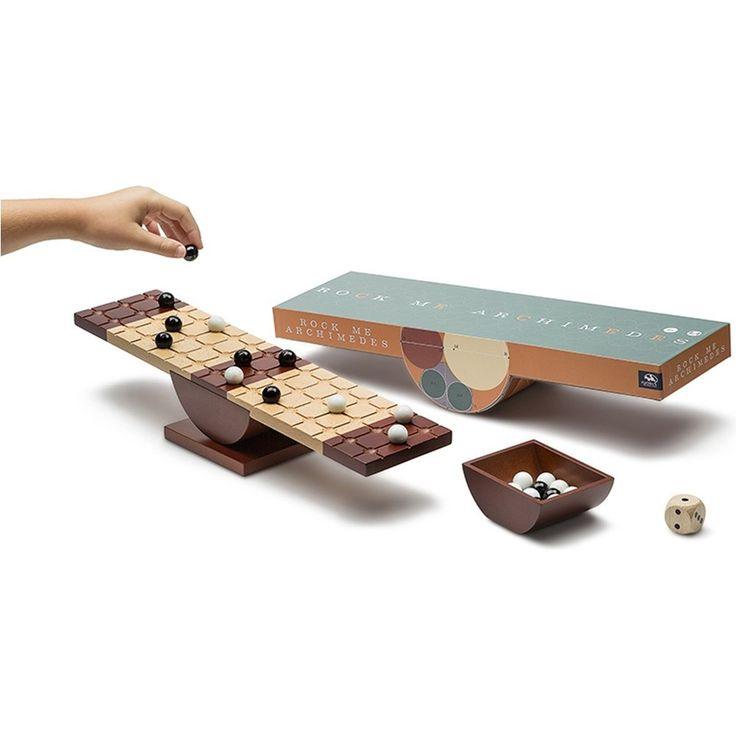
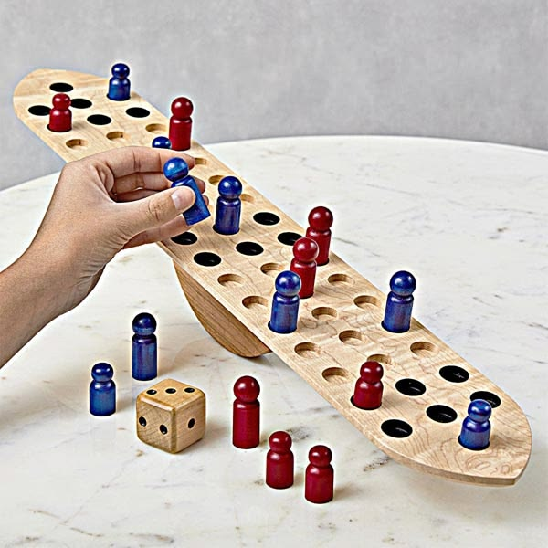

## 6. Outros Elementos

"16 Animali" de Enzo Mari
(https://www.danesemilano.com/en/productDetails?idProduct=60)

"A Fabula que deu origem ao projeto"
https://www.youtube.com/watch?v=2DrKmpuKhKE
