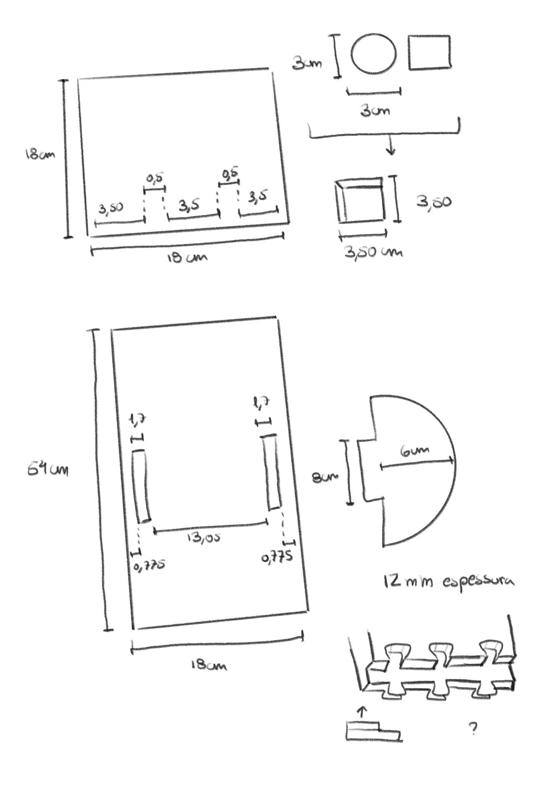
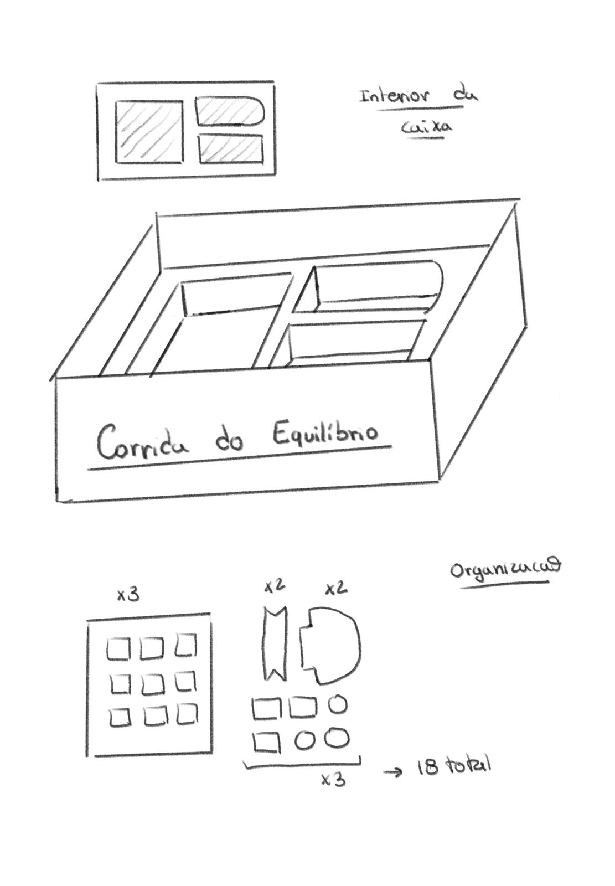

# Processo

## 1. Protótipo(s)

## 2. Processo de Prototipagem

Maquinação CNC, montagem, acabamentos pontuais. 

## 3. Modelos 3D

Embed do Fusion
(https://a360.co/3PQSive)

## 4. Esboços e Pranchas-Resumo

## 5. Pesquisa

### 5.1. Aspectos valorizados do moodboard, desconstrução da forma (o que distingue o programa formal)

### 5.2. Objetos de referencia

## 6. Outros Elementos

"16 Animali" de Enzo Mari
(https://www.danesemilano.com/en/productDetails?idProduct=60)

"A Fabula que deu origem ao projeto"
https://www.youtube.com/watch?v=2DrKmpuKhKE
