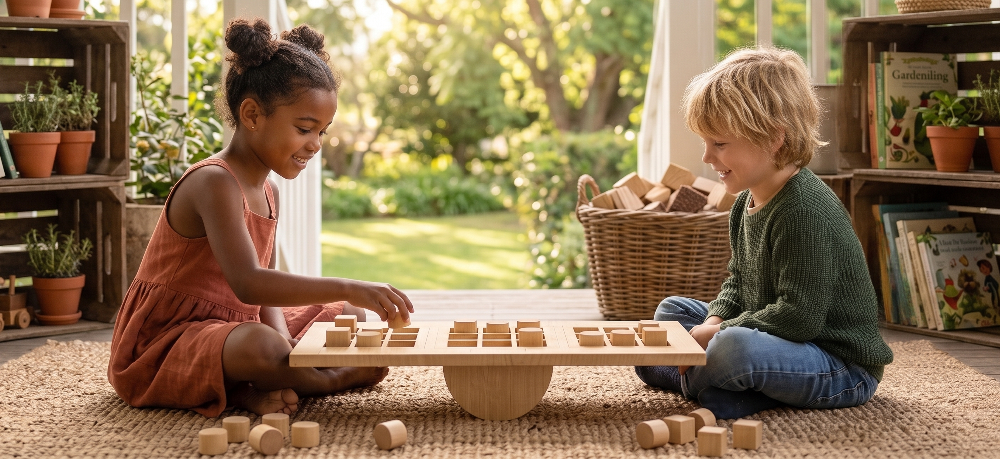

# A Lebre

<!--
  HERO: idealmente uma pseudo-sessão fotográfica do produto
  (ver tutorial Pletor.ai nos Recursos da disciplina, em
  /Recursos/AI_exps/). Usa attachments/hero.jpg para o frontmatter.
-->

> Brinquedo com movimento em madeira inspirado na lebre do conto "A Lebre e a Tartaruga".

## Conceito

**O que é?** 
A Lebre é um brinquedo feito de madeira inspirado na fábula "A Lebre e a Tartaruga". O brinquedo tem como principal característica o movimento das patas e orelhas e é todo concebido a partir de resíduos de madeira reaproveitados.

**Para quem?**  
Este produto, destinado a crianças a partir dos 5 anos, tem como objetivo desenvolver a imaginação e aprendizagem autónoma do público infantil

**Porquê?**  
O projeto foi criado com o objetivo de incentivar o desenvolvimento do pensamento e da concentração. Utiliza a madeira como material base para garantir uma produção sustentável, dando assim uma nova vida aos resíduos industriais.

## Enquadramento

Este jogo enquadra-se num contexto de grupo a partir da fábula da Lebre e da Tartaruga, utilizando a seu favor a competição inerente à narrativa. O foco principal desenrola-se em torno da moral "devagar se vai ao longe", onde a adoção de uma postura calma e estratégica possibilita a vitória.
## Tecnologia

O produto foi fabricado a partir da modelação no Autodesk Fusion 360, passando então para o processo de corte em CNC. O produto tem como objetivo ser fabricado em Madeira de Bétula de espessura 12mm.

- Modelo 3D: <!-- embed Fusion ou link a360.co -->https://a360.co/3PQSive

## Função

A "Corrida de Equilíbrio" tem como função desenvolver o raciocínio logico e objetivo dos mais novos, ajudando a desenvolver a iniciativa de resolução de problemas e a calma pelo pensamento estratégico.

**Como brincar:** 
A criança já tendo o tabuleiro montado pode então começar a jogar como um jogo do galo normal, sendo que são três grelhas, fica-se a joga-las a todas em simultâneo. Ao finalizar as peças cada jogador poder remover uma peça já presente no tabuleiro para outra abertura podendo estender o jogo, sendo que as peças circulares apenas se podem mover pelas casas nas perpendiculares, e as peças quadradas só podem ser movimentadas na diagonal, isto dificultando o jogo um pouco.

## Apresentação

## Processo

O percurso completo de iterações, modelos e pesquisa está em [processo.md](processo.md), organizado do **mais recente** para o **mais antigo**.

[Ver processo completo →](processo.md)
