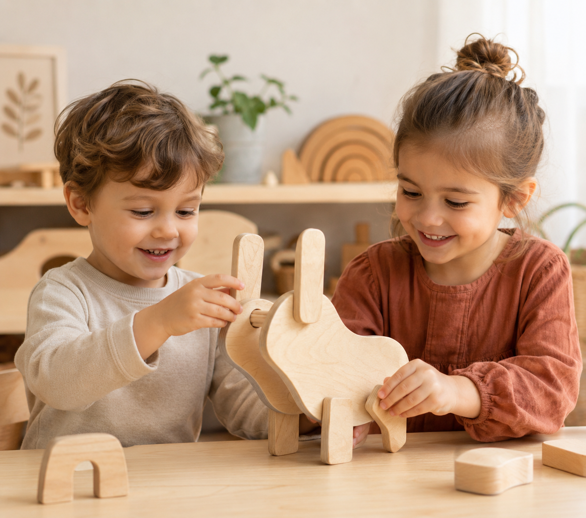

# A Lebre

<!--
  HERO: idealmente uma pseudo-sessão fotográfica do produto
  (ver tutorial Pletor.ai nos Recursos da disciplina, em
  /Recursos/AI_exps/). Usa attachments/hero.jpg para o frontmatter.
-->

> Brinquedo em madeira com movimento inspirado na lebre do conto "A Lebre e a Tartaruga".

## Conceito

**O que é?** 
O meu brinquedo consiste numa lebre em madeira, desenvolvida a partir do reaproveitamento de resíduos de madeira de bétula, promovendo uma abordagem sustentável no processo de conceção e produção. A escolha deste material deve-se às suas características de resistência, durabilidade e acabamento natural, que conferem ao brinquedo uma estética simples, orgânica e agradável ao toque.
A lebre apresenta uma linguagem formal minimalista, sendo composta por formas geométricas simplificadas que permitem uma identificação imediata da figura animal. Um dos seus principais elementos diferenciadores é a presença de partes móveis, nomeadamente as patas e as orelhas, que podem ser manipuladas pela criança. Este movimento acrescenta uma componente interativa ao brinquedo, tornando a experiência de utilização mais dinâmica e estimulante.

**Para quem?**  
Este brinquedo destina-se a crianças com idade superior a 5 anos, uma fase do desenvolvimento em que a capacidade motora, cognitiva e criativa se encontra em constante evolução. 

**Porquê?**  
A criação deste brinquedo surge da intenção de desenvolver um objeto lúdico que contribua positivamente para o desenvolvimento infantil, conciliando funcionalidade, valor pedagógico e consciência ambiental. O brincar assume um papel fundamental no crescimento da criança, sendo através dele que são desenvolvidas competências cognitivas, motoras, emocionais e sociais essenciais.
Para além da vertente educativa, este projeto procura responder à necessidade crescente de práticas mais sustentáveis no design de produto. A utilização de resíduos de madeira de bétula reaproveitados permite reduzir desperdícios e dar uma nova função a materiais que, de outra forma, poderiam ser descartados. Desta forma, o brinquedo não só promove o desenvolvimento da criança, como também reflete uma preocupação com a sustentabilidade e com a valorização responsável dos recursos naturais.

## Enquadramento

O presente projeto surge a partir da interpretação do conto tradicional **“A Lebre e a Tartaruga”**, uma fábula amplamente conhecida e transmitida ao longo de gerações. Partindo desta narrativa, o desenvolvimento do brinquedo procurou traduzir visualmente e conceptualmente a figura da lebre, transformando-a num objeto lúdico capaz de comunicar não apenas a sua identidade animal, mas também os valores simbólicos associados à personagem. 
A ligação ao conto permite que o brinquedo ultrapasse a sua função meramente recreativa, tornando-se também um veículo de transmissão de valores educativos, incentivando a reflexão sobre temas como persistência, humildade e superação.
## Tecnologia

Madeira de Bétula (12mm de espessura)/ CNC/ Autodesk Fusion 360

- Modelo 3D: <!-- embed Fusion ou link a360.co -->https://a360.co/4fSzLt6

## Função

O brinquedo foi concebido com uma abordagem minimalista e sustentável, privilegiando formas simples e materiais naturais, de forma a criar uma peça que estimule a interação, a imaginação e o desenvolvimento infantil.

**Como brincar:** 
A interação com este brinquedo baseia-se na manipulação física das suas partes móveis, proporcionando uma experiência lúdica dinâmica e intuitiva. A criança pode segurar, mover e explorar livremente a lebre, interagindo com as patas e as orelhas articuladas, que permitem alterar a sua posição e simular diferentes movimentos e posturas do animal.
O movimento das patas possibilita recriar ações associadas à lebre, como saltar, correr ou permanecer em repouso, enquanto a mobilidade das orelhas acrescenta expressividade à figura, permitindo representar diferentes estados de atenção ou emoção. Esta característica torna a brincadeira mais envolvente, incentivando a observação e a experimentação.

## Apresentação

## Processo

O percurso completo de iterações, modelos e pesquisa está em [processo.md](processo.md), organizado do **mais recente** para o **mais antigo**.

[Ver processo completo →](processo.md)
