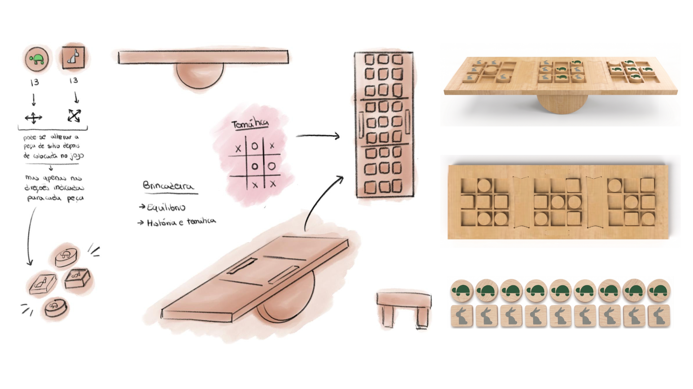
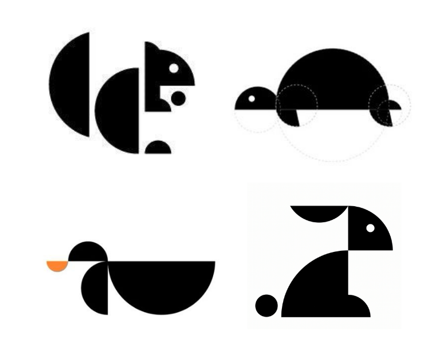
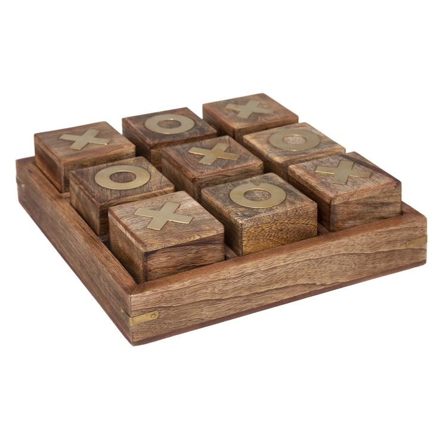

# Processo

## 1. Modelos 3D

https://a360.co/3PQSive

## 2. Esboços e Pranchas-Resumo

## 3. Pesquisa

### 3.1. Aspectos valorizados do moodboard, desconstrução da forma (o que distingue o programa formal)

### 3.2. Objetos de referencia

## 4. Outros Elementos

"A Fabula que deu origem ao projeto"
https://www.youtube.com/watch?v=2DrKmpuKhKE